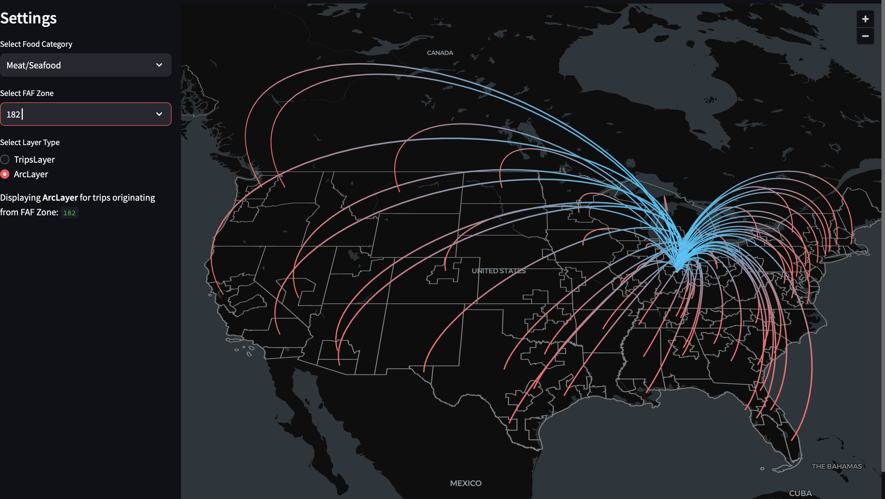

FAF Food Flows Dashboard

This Streamlit app visualizes food commodity flows across the U.S. using FAF (Freight Analysis Framework) data. You can explore movements of categories like grains, meat, live animals, and more—zone by zone.


> _Example visualization of food flows using ArcLayer_

How to Set Up

1. **Clone the repo**  
   ```bash
   git clone https://github.com/d-paul-1/Food-Flow-Project.git
   cd Food-Flow-Project

2. **Create a virtual environment**
    python -m venv venv
    source venv/bin/activate  # On Windows: venv\Scripts\activate

3. **Install the required packages**
    pip install -r requirements.txt

4. **Run the app**
    streamlit run app.py
    Open your browser to http://localhost:8501 if it doesn’t launch automatically.
